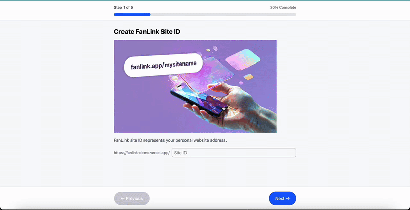
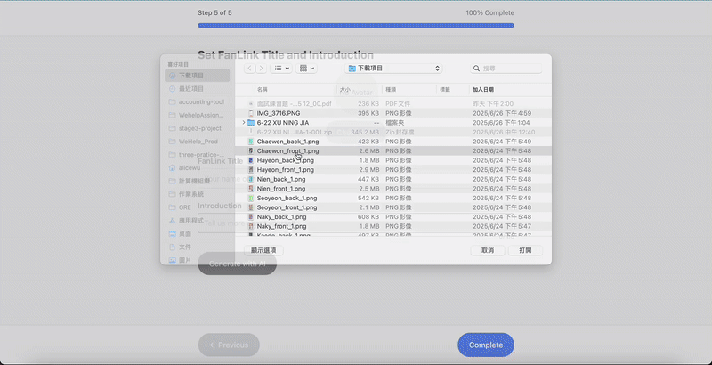
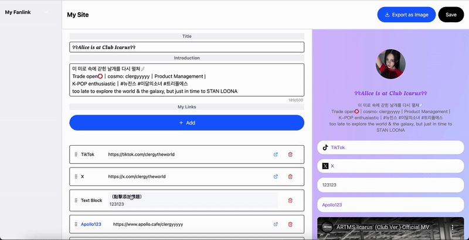
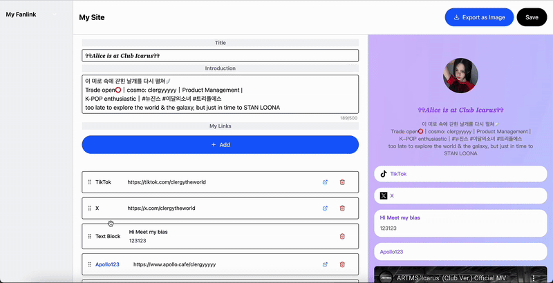
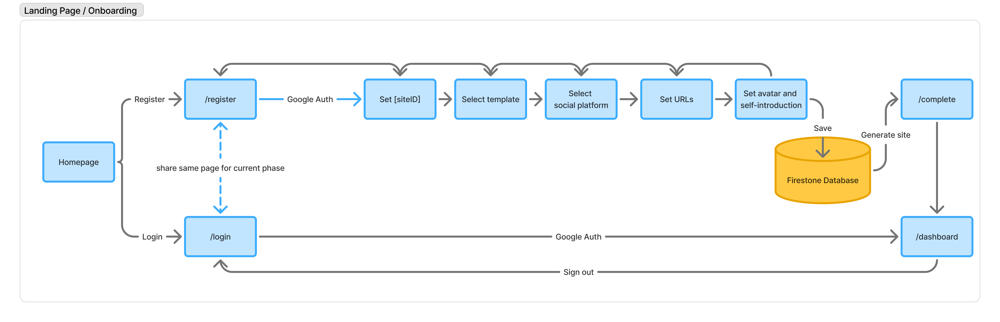
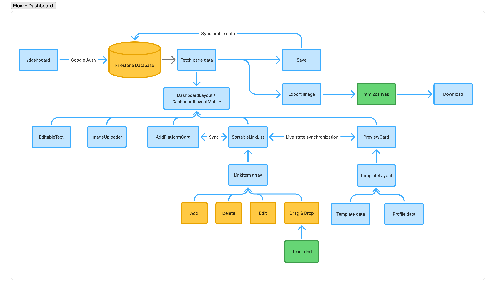

# About FanLink
FanLink is an all-in-one **Link-in-bio** tool designed for K-pop fans to connect, trade, and promote their favorite idols🥳!
It supports showcasing Cosmo Objekts (NFTs for Modhaus artists **tripleS, ARTMS, and idntt**) for trading use, enabling fans to display collections or listings.


**Currently supported platforms include:**
- Facebook
- Instagram
- Threads
- X (Twitter)
- LINE
- Shopee
- TikTok
- YouTube
- Spotify
- Apollo / Cosmo Objekts
- ... and more coming up!

```
Disclaimer: FanLink is not affiliated with, endorsed by, or supported by any K-POP entertainment company or its artists.
```

## Some Pretty Examples of FanLink Sites for Your Inspiration 💖
- Show Your Objekts! (https://fanlink-demo.vercel.app/clergyyyyy)

# FanLink Features
- Pretty and interactive product page

- Instantly create a beautiful personal site with your Google account

- Quickly complete and preview with confetti effect!

- Edit your personal site with real-time preview

- Drag and drop to re-organize your link order


# Technical Structure

## **Frontend Techniques**

### **React Components & Props**
- **Template System**: Dynamic template rendering using React components with customizable props for colors, fonts, and layouts
- **Reusable Component**: By using modular components such as `PreviewCard`, `TemplateLayout`, and `DashboardLayout` to render the elements in reusable components
- **Props Drilling Prevention**: By passing callback functions instead of state data to child components, allowing children to directly invoke parent callbacks without managing local state, such as `LinkItemProps` and `LinkItem`
- **Type Safety**: TypeScript with interface definitions for `Template`, `LinkItem`, and `ProfileData`

### **React Hooks**
- **useState**: Managing component state for form data(/onboarding), loading states(/dashboard)
- **useEffect**: Handling side effects for authentication, data fetching, and real-time updates
- **useRef**: Direct DOM manipulation for file uploads, drag-and-drop functionality, and animation controls
- **useImperativeHandle**: Exposing component methods for step validation in onboarding process
- **Custom Hooks**: 
  - `useTemplates`: Template data fetching and caching
  - `useScrollAnimation`: Intersection observer for scroll-triggered animations

### **Next.js**
- **App Router**: Modern routing with nested layouts and loading states
- **Dynamic Routing**: Public profile pages using `[siteID]` dynamic routes
- **Link Navigation**: Client-side navigation with prefetching

## **Backend Techniques**

### **Vercel**
- Deployment and hosting for Next.js apps, handling environment variables

### **Firebase Integration**
- **Authentication**: Google OAuth SSO with session management
- **Firestore Database**: 
  - Real-time document updates
  - Queries for user profile lookup
  - Set security rules for data protection

## **Animation & Visual Effects**

### **Framer Motion**
- **Scroll-Triggered Animations**: `whileInView` with viewport detection for content revelation on homepage
- **3D Interactive Card**: Mouse-tracking with `useMotionValue` and `useSpring` for rotateX/rotateY transformations on homepage
- **Rotating Gallery**: `useAnimation()` controls for pause/resume functionality with smooth cylindrical rotation on homepage
- **Page Transitions**: `AnimatePresence` with slide variants for onboarding step navigation (horizontal slide in/out with opacity) on onboarding page

## **User Interface & Experience**

### **General UI Design**
- **RWD**: Support desktop and mobile devices for all pages
- **Skeleton Screens**: Engaging skeleton placeholder during data fetching

### **Tailwind CSS**
- **Design System**: Custom color palette and button settings, reusable classes for common UI patterns

### **Lucide React Icons**
- **Consistent Iconography**: Unified icon set in the whole site

### **Drag & Drop Interface**
- **React DnD**: Professional drag-and-drop with HTML5 backend
- **Visual Feedback**: Highlighting drop zone by giving visual cues
- **Touch Support**: Mobile-compatible touch interactions

## **Data Management**

### **Form Handling**
- **Multi-step Wizard**: Progressive form validation with step-by-step completion
- **Real-time Validation**: Instant feedback for URL validation and username availability

### **State Management**
- **Controlled Components**: Centralized state management through props and callbacks
- **Local Storage**: Browser storage for temporary profile/avatar data
- **Real-time Sync**: Firebase listeners for live data updates

### **Image Processing**
- **ImgBB Integration**: Third-party image hosting with automatic optimization
- **Preview Generation**: Instant image preview before upload

## **Process**

### **Onboarding Experience**
- **User Profile Creation**: Automatic profile initialization on first login
- **OAuth Integration**: Seamless Google sign-in with Firebase Auth
- **Progressive Disclosure**: Step-by-step information collection
- **Validation Pipeline**: Real-time validation with custom error messaging
- **Progress Tracking**: Visual progress bar to demonstrate completion states



## **Dashboard Real-time Sync**

### **Live Preview System**
- **Shared State Management**: Centralized state lifting between edit components and preview component through parent Dashboard container
- **Immediate State Propagation**: Direct callback functions trigger instant preview updates without intermediate state management
- **Controlled Component Pattern**: `EditableText`, `SortableLinkList`, and `ImageUploader` components invoke parent state setters for real-time synchronization
- **Zero-Latency Rendering**: `PreviewCard` component receives props immediately upon state changes, ensuring instant visual feedback
- **Firestore Writeback**: By clickin Save button, triggers updateDoc() to save dashboard changes to user's Firestore profile document
- **Export Functionality**: Using html2canvas library for generating shareable images of user's FanLink profile



# Tooling
- Next.js v15
- Tailwind CSS v4
- Lucide-react component library
- Firebase (Auth, Firestore, Storage)
- Vercel for hosting
- TypeScript for type safety
- Framer Motion for animations
- React DnD for drag-and-drop
- OGL for WebGL effects

# Requirements
- Node.js 18+
- TypeScript
- React 19
- Next.js 15
- Tailwind CSS v4
- Firebase (Auth, Firestore, Storage)
- Vercel for deployment

# Setup
```bash
git clone git@github.com/clergyyyyy/bootcamp-stage-3
cd cosmo-web
pnpm install
cp .env.example .env.local
pnpm dev
```

# License
Licensed under the MIT License.

# Contact
- Discord: clergyyyyy
- Email: alicewu020@gmail.com
- Cosmo ID: clergyyyyy