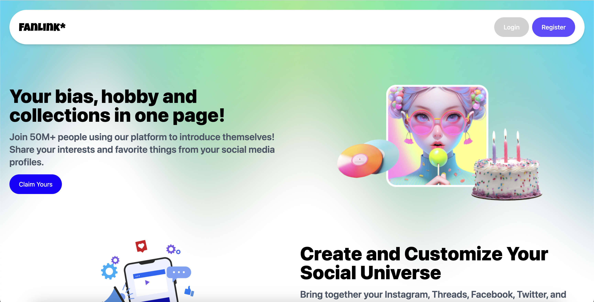
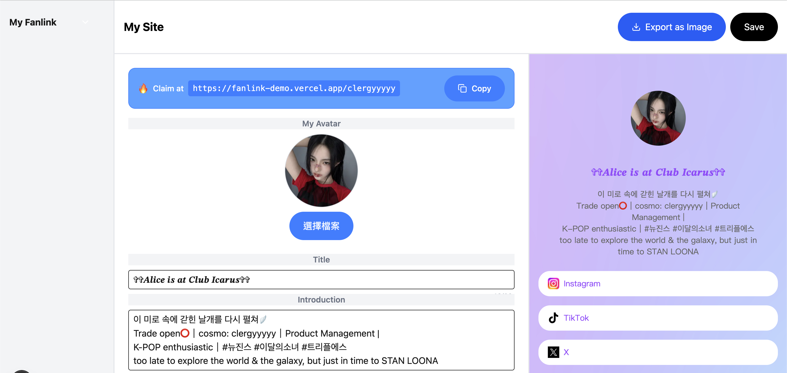
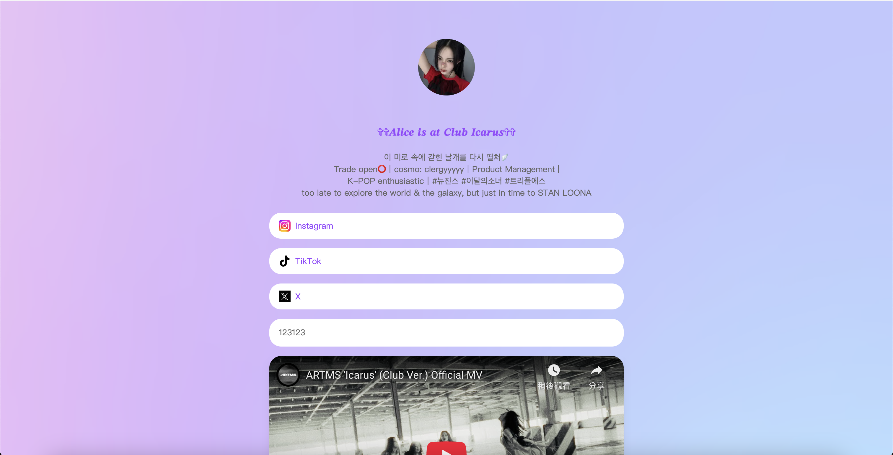

# About FanLink
FanLink is an all-in-one **Link-in-bio** tool designed for K-pop fans to connect, trade, and promote their favorite idols🥳!
It supports showcasing Cosmo Objekts (NFTs for Modhaus artists **tripleS, ARTMS, and idntt**) for trading use, enabling fans to display collections or listings.

**Currently supported platforms include:**
- Facebook
- Instagram
- Threads
- X (Twitter)
- LINE
- Shopee
- TikTok
- YouTube
- Spotify
- Apollo / Cosmo Objekts
- ... and more coming up!

```
Disclaimer: FanLink is not affiliated with, endorsed by, or supported by any K-POP entertainment company or its artists.
```

## Some Pretty Examples of FanLink Sites for Your Inspiration 💖
- Show Your Objekts! (https://fanlink-demo.vercel.app/clergyyyyy)

# FanLink Features
1. Instantly create a beautiful personal site with your Google account
2. Show and organize all your platform links
3. Display your digital Objekt cards
4. Promote your favorite idols
5. Share the events you’ve joined or plan to attend





# Requirements
Node.js 18+
TypeScript
React 19
Next.js 15
Tailwind CSS v4
Firebase (Auth, Firestore, Storage)
Vercel for deployment

# Setup
```
git clone git@github.com/clergyyyyy/bootcamp-stage-3
cd cosmo-web
pnpm install
cp .env.example .env.local
pnpm dev
```

# Tooling
Next.js v15
Tailwind CSS v4
Lucid-react component library
Firebase (Auth, Firestore, Storage)
Vercel for hosting

# License
Licensed under the MIT License.

# Contact
Discord: clergyyyyy
Email: alicewu020@gmail.com
Cosmo ID: clergyyyyy

